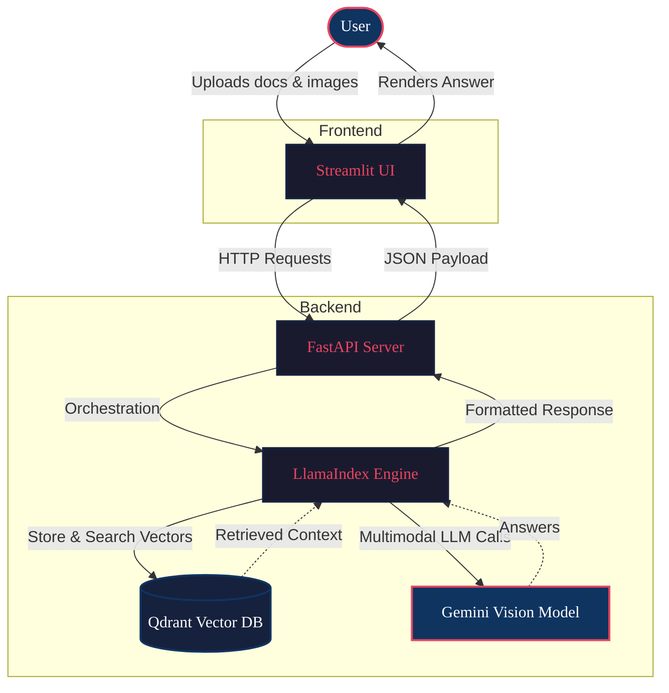

<div align="center">

# 🧠 Multimodal RAG Assistant

**A full-stack Retrieval-Augmented Generation assistant combining document search with image understanding.**

</div>

## What it is

This project is a **Multimodal RAG Assistant** that allows users to ask questions across a variety of unstructured data types—including PDF documents, Word documents (DOCX), and images. By combining a **FastAPI** backend with a **Streamlit** frontend, it delivers a smooth user experience backed by powerful machine learning frameworks. 

## Why it is different

Traditional RAG systems only operate on text. By leveraging **LlamaIndex** alongside the **Gemini Vision** model, this assistant seamlessly searches and reasons over both textual data and visual inputs (images). Extracted embeddings are indexed and retrieved lightning-fast using a **Qdrant** vector database.

## How it works

The architecture splits responsibilities between a lightweight interactive frontend and a heavy-lifting backend orchestration layer.



*(You can also find this diagram in [`assets/architecture.md`](assets/architecture.md)).*

## Core Technologies

- **Frontend:** [Streamlit](https://streamlit.io/)
- **Backend API:** [FastAPI](https://fastapi.tiangolo.com/)
- **Orchestration:** [LlamaIndex](https://www.llamaindex.ai/)
- **Vector Store:** [Qdrant](https://qdrant.tech/)
- **LLM & Vision:** Google Gemini Vision

## How to use

1. **Clone the repository.**
2. **Set up your environment variables:** Configure your Gemini API keys in the `.env` file (see `.env.example`).
3. **Start the backend:**
   ```bash
   cd backend
   pip install -r requirements.txt
   uvicorn main:app --reload
   ```
4. **Start the frontend:**
   ```bash
   cd frontend
   pip install -r requirements.txt
   streamlit run app.py
   ```
5. **Upload & Query:** Open the Streamlit web interface in your browser, upload your PDFs, DOCXs, or images, and start querying your multimodal context!

<br />

<div align="center">
<i>README MADE WITH <a href="https://github.com/example/beautify-github-readme">beautify-github-readme</a></i>
</div>
