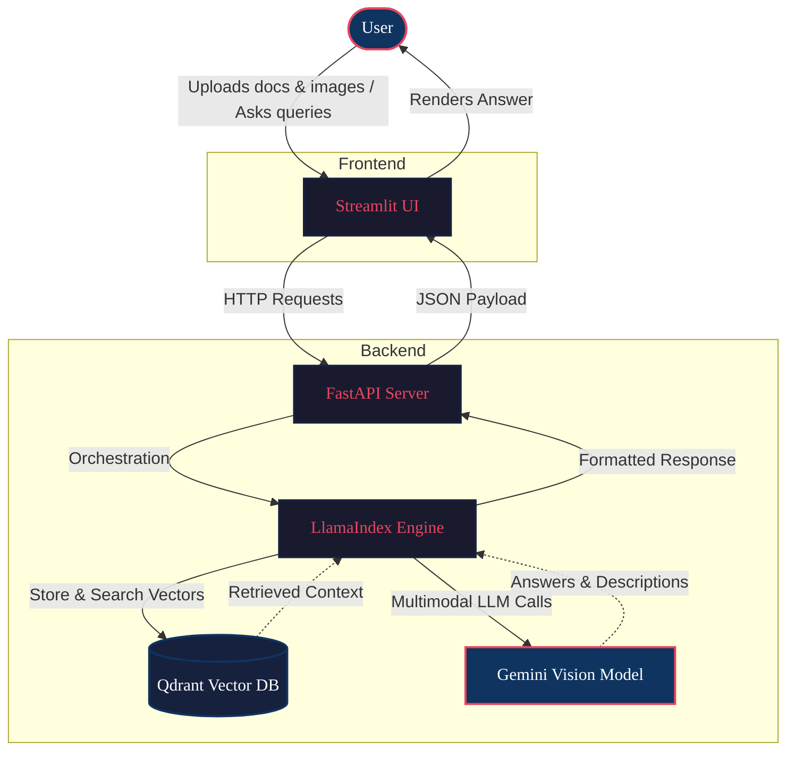

```mermaid
graph TD
    classDef default fill:#1a1a2e,stroke:#16213e,stroke-width:2px,color:#e94560,font-family:ui-monospace;
    classDef highlight fill:#0f3460,stroke:#e94560,stroke-width:2px,color:#fff;
    classDef db fill:#16213e,stroke:#0f3460,stroke-width:2px,color:#fff;

    User([User]):::highlight -->|Uploads docs & images / Asks queries| Streamlit[Streamlit UI]
    
    subgraph Frontend
        Streamlit
    end
    
    subgraph Backend
        FastAPI[FastAPI Server]
        LlamaIndex[LlamaIndex Engine]
        Qdrant[(Qdrant Vector DB)]:::db
        Gemini[Gemini Vision Model]:::highlight
    end
    
    Streamlit -->|HTTP Requests| FastAPI
    FastAPI -->|Orchestration| LlamaIndex
    
    LlamaIndex -->|Store & Search Vectors| Qdrant
    LlamaIndex -->|Multimodal LLM Calls| Gemini
    Qdrant -.->|Retrieved Context| LlamaIndex
    Gemini -.->|Answers & Descriptions| LlamaIndex
    
    LlamaIndex -->|Formatted Response| FastAPI
    FastAPI -->|JSON Payload| Streamlit
    Streamlit -->|Renders Answer| User
```
